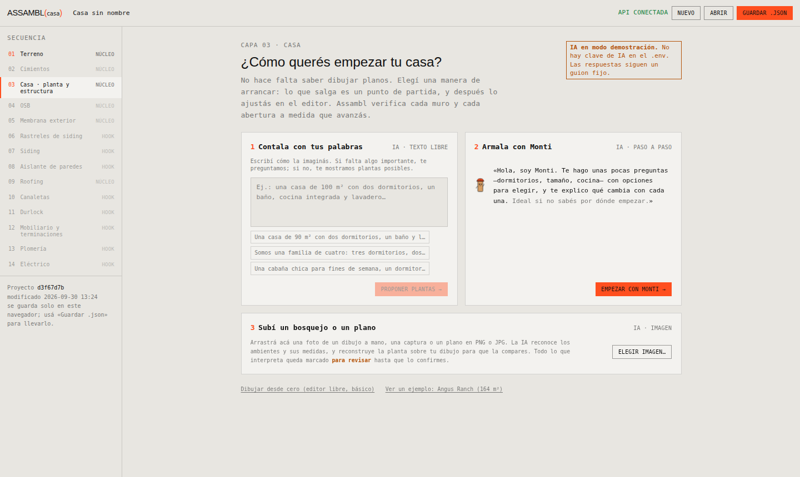
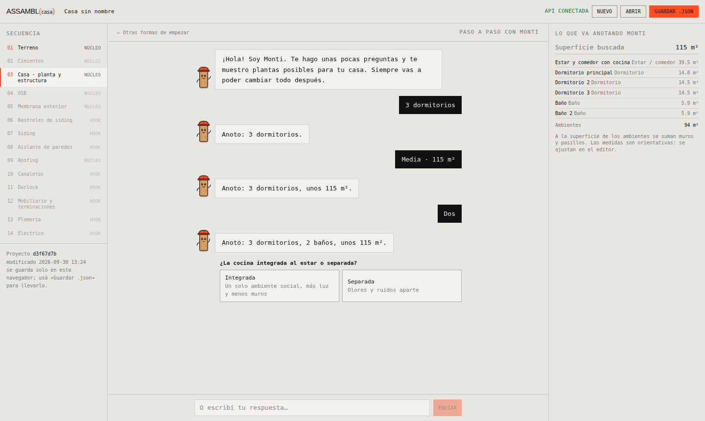
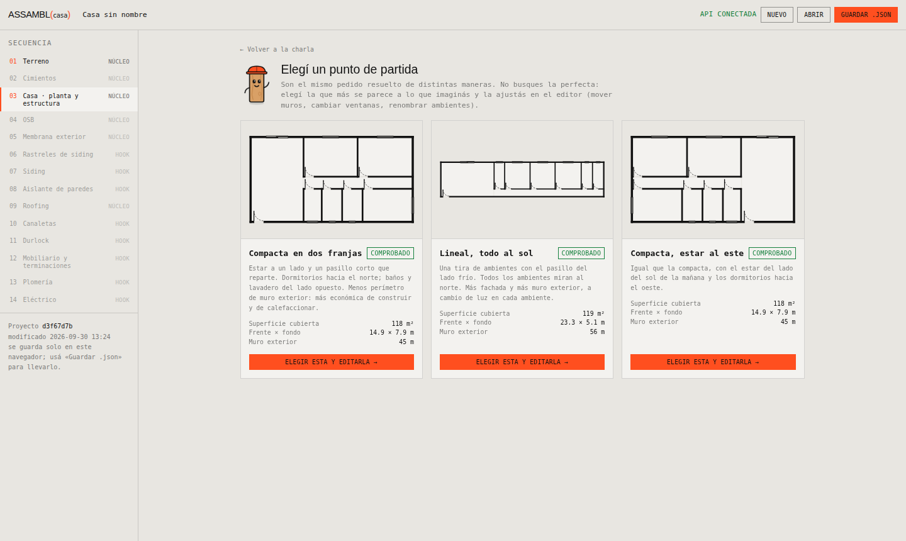
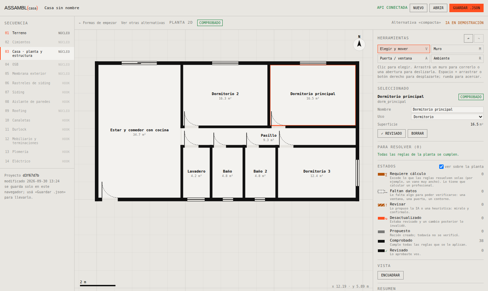
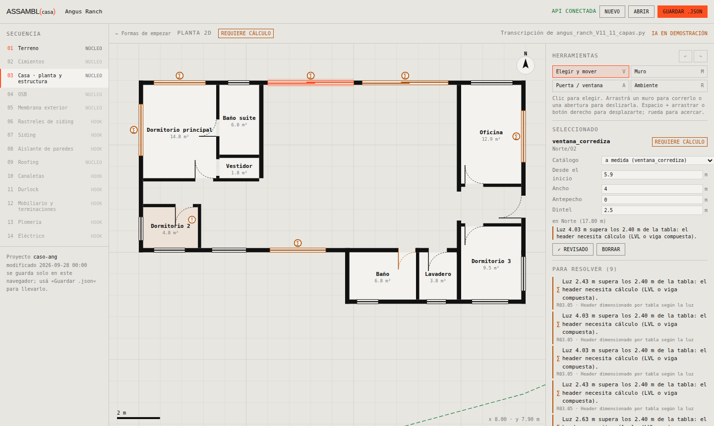
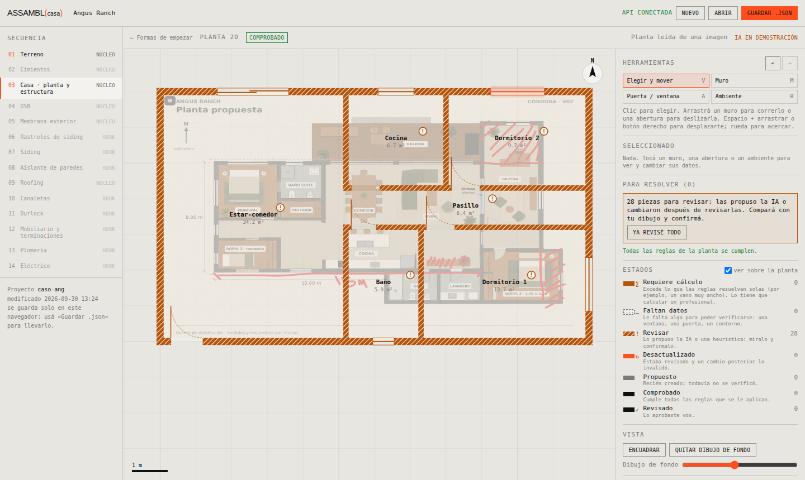

# Capa 03 · Casa — diseño del paso y del editor de planta

**Versión 0.1 · 30 de septiembre de 2026 · Documento de trabajo**

Este documento fija cómo el usuario llega a la planta de su casa y cómo la edita. El código vive en
`frontend/src/pasos/casa/` (interfaz), `backend/assambl/capas/casa.py` (generador de plantas),
`backend/assambl/reglas/r03_planta.py` (reglas) y `backend/assambl/ia/` (asistente y proveedores de IA).
Las capturas de `docs/paso_casa/` son el boceto: se decidió prototipar directamente en la aplicación, con
datos reales (Angus Ranch), en lugar de hacerlo en Figma. Así el prototipo que se prueba con usuarios es el
producto mismo.

| | |
| --- | --- |
|  Cómo empezar |  Charla con Monti |
|  Elegir un partido |  Editor de planta |
|  Estados en Angus Ranch |  Planta leída de un bosquejo, a revisar |

## 1. Para quién

El usuario **no** es arquitecto ni modelador 3D. Es alguien entusiasmado con construir su casa en woodframe
que nunca usó un programa de dibujo. De ahí salen cinco principios que atraviesan el paso:

1. **Nunca un lienzo en blanco sin ayuda.** La primera pantalla ofrece maneras de empezar, no herramientas.
2. **La IA entiende; las reglas construyen.** El asistente conversa y lee imágenes, pero no escribe muros:
   produce un *programa* (qué ambientes, qué tamaño) o *rectángulos aproximados*, y la geometría la arma
   `capas/casa.py` con reglas deterministas. Es lo que pide MVP_01 §4.4: la interfaz y el asistente llaman
   las mismas operaciones y ninguno escribe geometría por su cuenta.
3. **Todo es un punto de partida.** Lo que sale de cualquier entrada se abre en el mismo editor.
4. **Se ve qué está verificado y qué no.** Cada pieza muestra su estado sobre el plano (§5).
5. **Español rioplatense, sin jerga.** Si hay un término técnico, se explica en una línea.

## 2. El recorrido

```
                    ┌──────────────────────────────┐
                    │  ¿Cómo querés empezar tu casa?│  ← Inicio.tsx
                    └──────────────┬───────────────┘
      ┌──────────────┬─────────────┼───────────────┬─────────────────┐
      ▼              ▼             ▼               ▼                 ▼
 1 Contala con   2 Armala con   3 Subí un       Dibujar desde     Ver un ejemplo
 tus palabras    Monti          bosquejo        cero (básico)     (Angus Ranch)
 (IA, texto)     (IA, guiado)   (IA, imagen)
      │              │             │               │                 │
      └──────┬───────┘             │               │                 │
             ▼                     ▼               │                 │
        Charla.tsx          ImportarImagen.tsx     │                 │
   pregunta solo lo que   lectura + planta encima  │                 │
   falta · opciones con   de la imagen · dudas     │                 │
   su consecuencia        con opciones             │                 │
             │                     │               │                 │
             ▼                     │               │                 │
     Alternativas.tsx              │               │                 │
   2–3 partidos del mismo          │               │                 │
   programa: elegir uno            │               │                 │
             │                     │               │                 │
             └─────────────────────┴───────┬───────┴─────────────────┘
                                           ▼
                              Editor de planta 2D (EditorPlanta + PanelEditor)
                              verificación en vivo con R03 · deshacer · estados
```

**Prioridades** (como se acordó): las entradas 1 y 2 están completas; la 3 (dibujo libre) existe en su
versión básica —el mismo editor con la planta vacía— y no tiene asistencia propia todavía.

### 2.1 Entrada 1a · «Contala con tus palabras» (prompt libre)

- Un cuadro de texto con tres ejemplos que se pueden tocar para completarlo.
- El asistente extrae el programa y **solo pregunta si falta algo que cambia la forma de la casa**
  (cantidad de dormitorios, tamaño aproximado). Si alcanza, salta directo a las alternativas.
- Siempre se puede seguir charlando para ajustar («sumá un lavadero», «que el baño sea más grande»).

### 2.2 Entrada 1b · «Armala con Monti» (orientador)

**Monti** es un montante de madera con casco de obra (`Monti.tsx`). Es un personaje simple —pocas formas, dos
colores de marca— para que se lea a 38 px en la charla. Tiene cuatro ánimos: quieto (respira y parpadea),
pensando (mira arriba, puntos suspensivos), hablando (boca y brazo) y contento. Respeta
`prefers-reduced-motion`.

Reglas de conversación (están en el prompt de sistema, `ia/asistente.py`):

- **Una pregunta por vez**, siempre con **2 a 4 opciones** y la **consecuencia** de cada una en pocas
  palabras («Integrada · un solo ambiente, más luz y menos muros»). Siempre se puede escribir en vez de elegir.
- Primero lo que más cambia la casa: dormitorios → tamaño → baños → cocina integrada o separada → extras.
- Si el usuario no sabe, se sugiere la opción más común y se sigue. En 5 a 7 preguntas debe estar listo.
- Fuera del dominio (dos plantas, curvas, más de 200 m²) se explica por qué y se ofrece lo más parecido.
- A la derecha, «Lo que va anotando Monti» muestra el programa en vivo: ambientes, superficies y total.

### 2.3 Momento de decisión · alternativas

Cuando el programa alcanza, se muestran **tres partidos** del mismo pedido (`capas/casa.py → alternativas`):

| Partido | Qué es | A cambio de |
| --- | --- | --- |
| Compacta en dos franjas | Estar a un lado; pasillo corto; dormitorios al sol, baños y lavadero del lado opuesto | — (menos muro exterior) |
| Lineal, todo al sol | Una tira de ambientes, pasillo del lado frío | Más fachada y más muro exterior |
| Compacta, estar al este | La compacta espejada: estar con sol de mañana | — |

Cada tarjeta muestra la planta en miniatura con estados, superficie cubierta, frente × fondo y **metros de
muro exterior** (el dato que un entusiasta no mira y que más pesa en costo y en pérdida de calor). «Al sol»
significa norte en el hemisferio sur y sur en el norte: se usa la latitud de la capa 01 si existe.

### 2.4 Entrada 2 · «Subí un bosquejo o un plano»

1. Se arrastra una imagen (PNG/JPG). El navegador la achica a 1600 px antes de enviarla.
2. Opcionales: **ancho total del frente** (para escalar si el dibujo no tiene cotas) y aclaraciones.
3. La IA devuelve ambientes como rectángulos en metros, **la escala que usó** (cotas del dibujo, medida del
   usuario o estimada), su **confianza**, advertencias y **preguntas con opciones** para lo ambiguo. Tocar una
   opción vuelve a interpretar con esa aclaración.
4. `normalizar_rectangulos()` alinea bordes casi coincidentes y lleva todo a la grilla de 5 cm; el generador
   arma muros, aberturas y ambientes.
5. La planta se muestra **encima de la imagen** para compararla, y en el editor la imagen queda de fondo
   (calco) con opacidad regulable.
6. **Todas las piezas nacen `pendiente_revision`.** El usuario corrige y confirma, pieza por pieza
   («✓ Revisado») o en bloque («Ya revisé todo»).

Un ambiente en L se lee como dos rectángulos «Estar (a)» y «Estar (b)»; entre ellos no se pone muro.

### 2.5 Dibujo libre y ejemplo

- **Dibujar desde cero** abre el editor vacío con una indicación para empezar con la herramienta Muro.
- **Ver un ejemplo** carga `casos/angus_ranch.assambl.json` (el caso de regresión de V11). Sirve para
  mostrar el editor con una casa real y con estados no triviales: sus corredizas de 4 m «requieren cálculo» y
  el estar-comedor «faltan datos» porque V11 no lo delimita.

## 3. El editor de planta 2D

Lienzo SVG en metros, con X al este e Y al norte (convención de Angus Ranch). Muestra grilla de 1 m / 5 m,
norte, barra de escala, coordenadas del cursor, el lote de la capa 01 (línea verde) y el calco si lo hay.

| Herramienta | Tecla | Qué hace |
| --- | --- | --- |
| Elegir y mover | V | Clic elige. Arrastrar un muro lo corre en perpendicular y **arrastra lo conectado**: los extremos de los muros que apoyan contra él, los bordes de los ambientes y la posición de sus aberturas. Arrastrar una abertura la desliza por su muro sin dejarla pisar otra. |
| Muro | M | Clic en cada quiebre. **Siempre a 90°** (gana el eje con más recorrido). Imanes a extremos existentes, alineación con extremos a 10 px y grilla de 5/10/25 cm según el zoom. Muestra el largo mientras se dibuja. Al cerrar sobre un extremo termina la cadena; doble clic o Esc también. Se elige el sistema: exterior 45 × 140, interior portante o tabique 45 × 90. |
| Puerta / ventana | A | Se elige un ítem del **catálogo** (`catalogo/ar.json`, familia `aberturas`) y se hace clic sobre un muro. Una sombra muestra dónde queda y avisa «no entra» antes de hacer clic. |
| Ambiente | R | Se arrastra un rectángulo; al soltar se elige el ambiente y el foco va al nombre. |

Además: rueda para acercar, espacio + arrastrar o botón derecho para desplazarse, Supr para borrar, Esc para
soltar, Ctrl+Z / Ctrl+Shift+Z para deshacer y rehacer (80 pasos).

El panel derecho tiene las propiedades de lo elegido (sistema y largo del muro; catálogo, posición, ancho,
antepecho, dintel, bisagra y sentido de la puerta; nombre y uso del ambiente), la lista **«Para resolver»**
(cada ítem lleva a su pieza y la resalta al pasar el mouse), la leyenda de estados con cantidades y un resumen
(superficie cubierta, muro exterior, piezas).

Todas las ediciones son operaciones puras en `operaciones.ts` (`agregarMuro`, `moverMuro`,
`agregarAbertura`, `modificarAbertura`, `agregarAmbiente`, `marcarRevisado`…) que devuelven una casa nueva.
La huella se recalcula encadenando los muros exteriores. Lo que la casa trae de otras capas (cubiertas,
instalaciones, mobiliario) se conserva sin tocar.

## 4. Formato

La planta se guarda en `proyecto.casa` con el esquema `assambl/casa@0.1` de Angus Ranch: muros por eje con sus
aberturas (`posicion_m` desde el inicio del eje), ambientes con contorno en la cara interior del muro,
sistemas constructivos y huella. Se agregan tres campos opcionales por pieza:

- `estado`: el declarado (ver §5).
- `revision: {fecha}`: cuándo lo aprobó el usuario.
- `catalogo`: código del ítem de catálogo de una abertura.

## 5. Estados sobre cada pieza

Cada muro, abertura y ambiente muestra un estado de MVP_01 §4.4 con **tres canales redundantes** (relleno,
trama, insignia con glifo), para que se lea sin depender del color. La idea visual: lo resuelto se ve «como un
plano» (negro sólido); lo que pide atención se destaca; lo que no se sabe se ve hueco.

| Estado | Muro | Ambiente | Insignia | Significado para el usuario |
| --- | --- | --- | --- | --- |
| `comprobado_por_reglas` | Negro sólido | Claro | — | Cumple todas las reglas que se le aplican. |
| `propuesto` | Gris | Claro | — | Recién creado; todavía no se verificó. |
| `pendiente_datos` | Hueco punteado | Rayado gris | … | Le falta algo: una ventana, una puerta, un contorno. |
| `pendiente_calculo` | Ámbar sólido | Tinte ámbar | ∑ | Excede las reglas (vano muy ancho): lo calcula un profesional. |
| `pendiente_revision` | Ámbar rayado | Tinte ámbar | ! (solo en ambientes) | Lo propuso la IA o una heurística: miralo y confirmalo. |
| `revisado` | Negro sólido | Tinte verde | ✓ | Lo aprobaste vos. |
| `desactualizado` | Naranja señal | Tinte naranja | ↻ | Estaba revisado y un cambio lo invalidó. |

**Cómo se combinan** (`estados.ts → estadoPieza`):

1. Lo que una regla marca `pendiente_calculo` **gana siempre**: no se puede tapar con «Revisado».
2. Si no, manda el estado declarado cuando es `revisado`, `desactualizado` o `pendiente_revision`.
3. Si no, el que dan las reglas R03; sin API, el guardado.

**Transiciones:** crear o editar una pieza la deja `propuesto` (es una propuesta nueva del usuario y las
reglas la vuelven a verificar); si estaba `revisado`, pasa a `desactualizado`. Lo leído de una imagen nace
`pendiente_revision`. «✓ Revisado» la pasa a `revisado`. El estado de la planta en el encabezado es el más
grave de los que se ven. «Ver sobre la planta» apaga los colores y deja el plano limpio.

`pendiente_revision` suele abarcar toda una planta leída por IA; por eso en muros y aberturas lo dice la trama
y la insignia «!» queda solo en los ambientes, para no llenar el plano de signos.

## 6. Reglas R03 de la planta

`reglas/r03_planta.py` (versión 0.1). Cada verificación nombra las piezas a las que se aplica y el estado de la
pieza es el peor que recibe. Se ejecutan en el backend a cada cambio (250 ms de espera).

| ID | Verifica | Si falla |
| --- | --- | --- |
| R03.01 | Muros a 90° (dominio del MVP_01) | `pendiente_revision` |
| R03.02 | Superficie cubierta entre 40 y 200 m² | `pendiente_revision` |
| R03.03 | Ningún muro menor a 30 cm | `pendiente_revision` |
| R03.04 | La abertura entra en su muro con lugar para el king (10 cm al extremo) y no pisa otra | `pendiente_revision` |
| R03.05 | Header por tabla según la luz del vano en bruto (nominal + 2 × 15 mm): 2 × 6 hasta 1,20 m; 2 × 8 hasta 1,80 m; 2 × 10 hasta 2,40 m | `pendiente_calculo` |
| R03.06 | Puertas de al menos 2,00 m de alto | `pendiente_revision` |
| R03.07 | El ambiente tiene contorno | `pendiente_datos` |
| R03.08 | Dormitorio ≥ 7,5 m² y 2,4 m de lado; baño ≥ 2,4 m² | `pendiente_revision` |
| R03.09 | Dormitorios, estar y oficina tienen ventana en un muro exterior | `pendiente_datos` |
| R03.10 | Cada ambiente tiene puerta o paso (o está abierto a otro) | `pendiente_datos` |

Los umbrales son de partida (MVP_01 §3.3: deben ratificarse con el especialista). Nota: medida en vano bruto,
una corrediza de 2,40 m ya pide cálculo; por eso el generador propone corredizas de 2,00 m.

## 7. Inteligencia artificial

### 7.1 Proveedor intercambiable

Todo el producto habla con la IA por una sola operación, `completar_json(sistema, mensajes, imagenes)`
(`ia/proveedores.py`). Los prompts y la validación viven en `ia/asistente.py` y no dependen del prestador.
Se cambia de prestador **solo desde el `.env`**:

| Variable | Para qué |
| --- | --- |
| `IA_PROVEEDOR` | `openai`, `anthropic` o `simulado`. Vacío: el primero que tenga clave. |
| `IA_MODELO` | Modelo; por defecto `gpt-5-mini` (OpenAI) o `claude-opus-5-5` (Anthropic). |
| `OPENAI_API_KEY` | Clave de OpenAI. |
| `ANTHROPIC_API_KEY` | Clave de Anthropic. |
| `IA_URL_BASE`, `IA_API_KEY` | Cualquier servicio compatible con Chat Completions (OpenRouter, Groq, DeepSeek, Mistral, Together, Ollama, LM Studio…). |

- `openai` usa Chat Completions por HTTP con salida en modo JSON; `anthropic` usa el SDK oficial.
- `simulado` no sale a internet: sigue un guion fijo (preguntas del orientador y lectura del texto por
  palabras clave) y, para imágenes, devuelve una planta de demostración **marcada como tal**. Es lo que se usa
  sin clave, en las pruebas y para desarrollar la interfaz. La interfaz avisa «IA en demostración».
- La respuesta se valida con pydantic; si no valida, se le devuelve el error al modelo **una vez** para que la
  corrija. Después se normaliza: ids únicos y superficies que cierran con la superficie objetivo.
- `GET /api/casa/ia` informa proveedor y modelo activos (sin exponer la clave).

Agregar otro prestador es escribir una subclase de `Proveedor` con `completar_json` y sumarla en
`obtener()`.

### 7.2 Privacidad

Las imágenes y el texto que el usuario escribe se envían al prestador configurado. Conviene decirlo en la
interfaz antes de la prueba con usuarios y revisar la política de retención del prestador elegido.

## 8. Rutas nuevas

```
GET  /api/casa/ia                    proveedor de IA activo
GET  /api/casa/catalogo              catálogo del mercado (aberturas)
POST /api/casa/conversar             un turno de charla → mensaje, pregunta con opciones, programa, listo
POST /api/casa/alternativas          programa → 3 partidos con su casa y su análisis R03
POST /api/casa/interpretar-imagen    imagen (data URL) → lectura, planta a revisar, análisis
POST /api/casa/analizar              casa → estado por pieza y verificaciones R03
```

## 9. Pendientes

- **Probar con la clave real de OpenAI** el orientador, el texto libre y la lectura de bosquejos (hasta ahora
  se probó el recorrido completo con el proveedor simulado y el contrato con un proveedor falso en las pruebas).
  Armar un set de 10–15 bosquejos reales para medir la lectura de imágenes.
- **Monti en el editor:** pedir cambios en lenguaje natural sobre la planta ya elegida («agrandá el
  dormitorio principal») traducidos a operaciones.
- **Implantación:** mover y girar la casa sobre el lote, con retiros dibujados (hoy se centra en el lote).
- **Dibujo libre asistido:** detectar ambientes cerrados por muros y proponer nombres.
- Partidos en L y en U; galería como volumen.
- Prueba de usabilidad con 5 entusiastas: ¿entienden los estados sin la leyenda? ¿qué entrada eligen?
